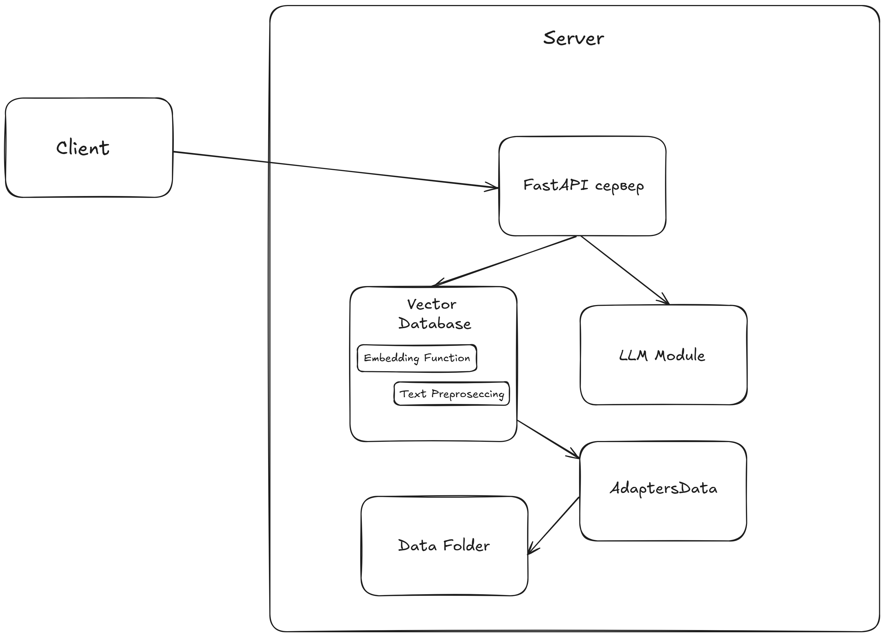

# Серверная часть рекомендательной системы для предсказания диагноза по протоколу осмотра


## Ссылка на клиентскую часть приложения

https://github.com/nik9ta5/appfrntRecSys

## Архитектура приложения
### Диаграмма компонентов


**FastAPI сервер** - Серверное приложение, обработка запросов.

**Vector Database** - Векторная база данных. Используется для векторного поиска по документам.

**LLM Module** - Языковая модель, генерация ответа, на основе данных, полученных от векторной базы данных.

**Embedding Function** - Модель для создания эмбеддингов. Модель которая используется в Vector Database для создания эмеддингов из текстовых данных.

**Text Preproseccing** - Предобработка текста.

**Data Folder** - Директория со всеми документами, используемыми в системе, различные форматы текстовых данных, которые будут переведены в векторное представление и помещены в векторную базу данных.

**AdaptersData** - Адаптеры для различных форматов данных, хранимых в Data Folder. Получение текстовых данных из разных форматов, для представления в определенной форме и передачи в векторную базу данных.

### Описание подхода
* Данное решение основано на генерации ответа с дополненным извлечением. При поступлении запроса с данными о пациенте, от клиента, формируется запрос и преобразуется в эмбеддинг (многомерный вектор), с помощью **Embedding Function** и поступает в векторную базу данных, в векторной базе данных осуществляется поиск наиболее близких векторов, в качестве меры сходства используется косинусное подобие. 
* Из векторной базы данных извлекаются 10 наиболее близких, по косиносному подобию объектов (протоколов осмотров) - результаты поиска. 
* Формируется промпт: данные о пациенте, 10 наиболее близких протоколов осмотров. Промпт передается в языковую модель. В промпте содержится инструкция, что языковая модель, должна определить диагноз пациента (полученные с клиента), на основе тех данных, которые ей переданы (10 наиболее близких протоколов осмотров).
* Модель генерирует ответ, после чего ответ отправляется клиенту. Ответ от модели — диагноз, который определила модель, на основе данных, содержащихся в промпте.
* Чтобы удостовериться в результате модели на клиент, вместе с ответом модели, отправляются извлеченные объекты из векторной базы данных (10 наиболее близких протоколов осмотров).
* Векторная база данных содержит текстовые данные, содержащихся в **Data Folder**, извлеченные с помощью **AdaptersData**. 
Так как форматы данных могут быть разные, для каждого формата необходимо написать свой адаптер, для извлечения. 
В данной работе представлено извлечение только для двух частных случаев документов, представленных в **Data Folder**.

## Используемые модели

Модель для создания эмбеддингов — https://huggingface.co/ai-forever/sbert_large_nlu_ru
Поддерживает русский язык.

Языковая модель: **Vikhrmodels/Vikhr-Qwen-2.5-0.5b-Instruct** — https://huggingface.co/Vikhrmodels/Vikhr-Qwen-2.5-0.5b-Instruct
Квантованая модель, поддерживает русский язык.

## Требования для запуска

**Рекомендуется запускать с CUDA**

Перед запуском приложения рекомендуется создать новое виртуальное окружение, чтобы избежать ошибок совместимости.

```bash
python -m venv name_venv
```

Активируйте созданное окружение

```bash
cd name_venv/Scripts/activate
```

Перед запуском необходимо установить 
* **CUDA**, перейти по ссылке и выбрать соответствующую конфигурацию и установить — https://developer.nvidia.com/cuda-downloads

* **CUDA для PyTorch**, необходимо перейти по ссылке, выбрать соответствующую конфигурацию и установить — https://pytorch.org/get-started/locally/

**CUDA для PyTorch** необходимо установить в созданное виртуальное окружение (должно быть активировано)

После установки **CUDA** и **CUDA для PyTorch**

Клонировать репозиторий 

```bash


git clone https://github.com/nik9ta5/appserverRecSys.git
```

Перейти в папку с проектом


```bash
cd appserverRecSys
```

Установить необходимые зависимости (выполнить команду представленную ниже)

```bash

pip install -r requirements.txt
```

## Запуск
Точка входа в приложение - ./app/main.py 

Принимаемые параметры:

* --fullVDB - заполнение векторной базы данных (**указывать при первом старте приложения**)
* --delVDB - удаление всего содержимого векторной базы данных

Перейти в папку **app** и запустить приложение
```bash

cd app
python main.py --fullVDB
```
**При слишком долгой загрузке базы данных/зависании скрипта на данном этапе** - скачайте и распакуйте архив с БД (https://drive.google.com/file/d/1uCF6-AhxdSDg34yzxAXSJ6zM9VnSLhOz/view?usp=sharing) вручную в папку **app/vectordadabase**


## Отслеживаемые пути
Приложение работает локально по адрессу: http://127.0.0.1:5000


При необходимости можно изменить в файле ./app/main.py 

### Передача данных с клиента
**POST** http://127.0.0.1:5000/preddiagnose

```json

{
  "visits" : "",
  "complaint" : "",
  "anamnesis" : "",
  "objective_status" : "",
  "diagnosis_details" : "",
  "recommendations" : ""
}
```

## Контакты 

- **Telegram [Никита](https://t.me/nik9ta)**
- **Telegram [Маруся](https://t.me/ponyfunan)**


